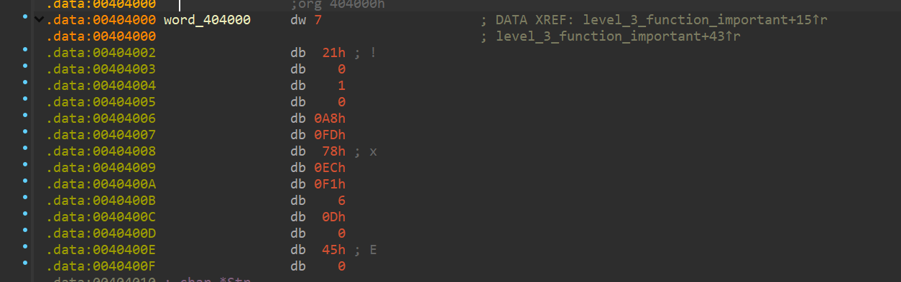
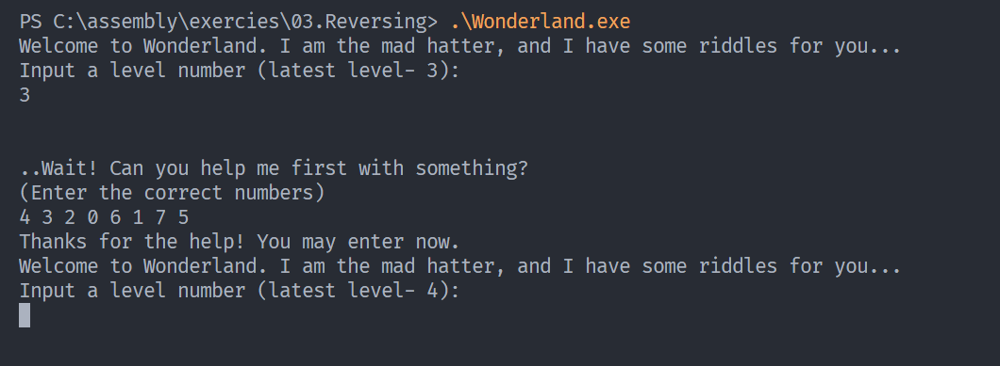

# Static Analysis Assignment

* Daniel Attali
* 328780879
* May 14th 2025

## Wonderland Riddles

### Level-2

#### Challenge Analysis

For level 2 of the Wonderland CTF, I encountered a variation on the familiar "into the rabbit hole" password. Upon examining the executable in IDA Pro, I identified a critical section of assembly code that processes user input:


Key Observations
While level 1 XORed each byte of the input with the simple value 0x10, level 2 introduced more complexity:

The operation now uses the 32-bit (4-byte) value `0x41524241h` as the XOR key
When converted to ASCII, this key spells "ABRA" (potentially a reference to "abracadabra")
The input is processed 4 bytes (one DWORD) at a time, not one byte at a time
This requires handling the little-endian byte ordering used by x86 architecture
Solution Approach

```asm
mov     eax, [ebp+var_4]
mov     ecx, dword ptr [ebp+eax+Buffer]   ; Load 4 bytes from Buffer into ecx
xor     ecx, 41524241h                    ; XOR those 4 bytes with "ABRA"
mov     edx, [ebp+var_4]
mov     dword ptr [ebp+edx+Buffer], ecx   ; Store the result back into Buffer
```

Recognizing that I needed to adapt my XOR script to handle DWORD-sized operations, I developed the following Python solution:

```python
import sys
import struct

def xor_string_dword(key: int, string: str):
    result = ""
    # Make sure string length is a multiple of 4 by padding with zeros if needed
    while len(string) % 4 != 0:
        string += "\0"
    
    for i in range(0, len(string), 4):
        # Take 4 characters and convert to dword (little-endian)
        chunk = string[i:i+4]
        dword_value = struct.unpack("<I", chunk.encode())[0]
        
        # XOR the entire dword with the key
        xored_dword = dword_value ^ key
        
        # Convert back to 4 characters
        xored_chunk = struct.pack("<I", xored_dword).decode(errors='replace')
        result += xored_chunk
    
    return result

if __name__ == "__main__":
    if len(sys.argv) != 3:
        print("Usage: python riddle2.py <key_in_hex> <string>")
        sys.exit(1)

    # Parse key in hexadecimal
    key = int(sys.argv[1], 16)
    string = sys.argv[2]

    result = xor_string_dword(key, string)
    print(result)
```

Execution and Solution
Running my script against the known password string with the XOR key:

<!-- Insert terminal screenshot showing the command execution here -->


This produced the encoded string which successfully allowed me to progress to level 3.

Key Takeaways
The challenge emphasizes the importance of understanding how data is processed at the assembly level
XOR operations remain a common obfuscation technique in reversing challenges
Proper handling of byte ordering (endianness) is crucial when working with multi-byte data
Using Python's struct module provides an elegant way to handle binary data transformations
This level reinforced the fundamentals of binary operations while introducing complexity through DWORD-based transformations rather than simple byte operations.

### Level-3

Challenge Analysis
For level 3 of the Wonderland CTF, I encountered a different type of puzzle - instead of a password string, the program asked for 8 numeric inputs. After disassembling the executable, I identified the following key components:

1. The program requests 8 numbers from the user
2. Each number must be in the range 0-7 (inclusive)
3. A validation function (check_riddle3_solution) determines if the sequence is correct

Function of intrerest:


The function above is responsible for validating the user input. It compares the user-provided numbers against a predefined array of values. It checks with the `word_404000` array, which is defined in the data section of the program. The function iterates through the user input and compares each number with the corresponding value in the `word_404000` array.



Taking the asm to a C style array gives us the following:

```c
__int16 word_404000[8] = { 7, 33, 1, -600, -5000, 1777, 13, 69 };
```

And looking at the assembly code we understand that the program is taking 8 numbers [0-7] and checking it with the word_404000 array. but instead of looking at the numbers as the values we look at them as indexes to the array. So we understood that the challenge is to find the write order of indeces to get an order from the smallest to the largest number in the array.

Final Solution

`4 3 2 0 6 1 7 5`

`-5000 < -600 < 1 < 7 < 13 < 33 < 69 < 1777`



