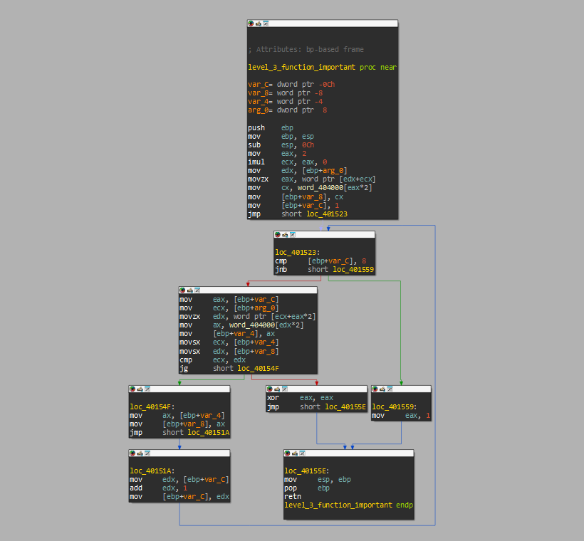
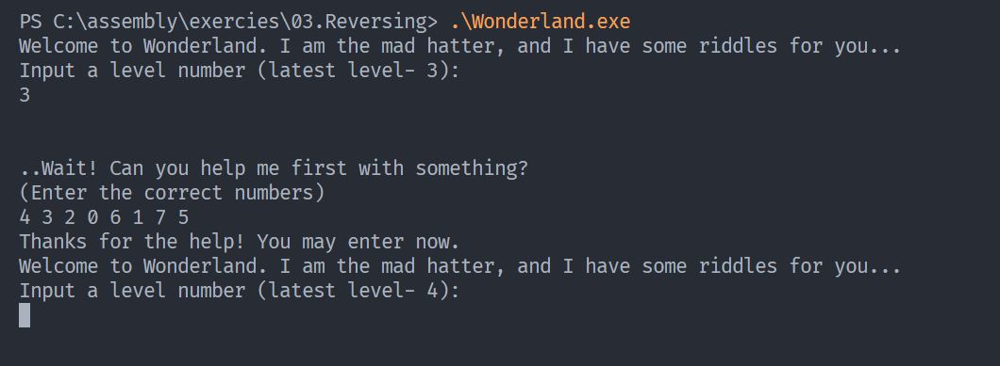

# Static Analysis Assignment

* **Name**: Daniel Attali  
* **ID**: 328780879  
* **Date**: May 14th, 2025  

## Wonderland Riddles

This report documents my solutions to levels 2 and 3 of the Wonderland CTF challenge. Each level required static analysis of the provided `wonderland.exe` file and the use of programming to solve the riddles.

---

### Level 2: XOR Transformation

#### Challenge Analysis

In level 2, the challenge involved deciphering an encoded password through an XOR-based transformation. By examining the executable in IDA Pro, I identified the key assembly code responsible for processing user input.

#### Assembly Code

![[image.png]]

Below is the critical snippet of assembly code found in the function handling the password:

```asm
mov     eax, [ebp+var_4]
mov     ecx, dword ptr [ebp+eax+Buffer]   ; Load 4 bytes from Buffer into ecx
xor     ecx, 41524241h                    ; XOR those 4 bytes with "ABRA"
mov     edx, [ebp+var_4]
mov     dword ptr [ebp+edx+Buffer], ecx   ; Store the result back into Buffer
```

#### Key Observations

1. **XOR Key**: The transformation used `0x41524241` as the XOR key, which represents "ABRA" in ASCII (a possible reference to "abracadabra").
2. **DWORD Operations**: Unlike level 1, which processed one byte at a time, level 2 processes input in 4-byte chunks (DWORDs).
3. **Endianness**: Since x86 architecture uses little-endian byte ordering, the input must be carefully processed.

#### Solution Approach

To automate the decoding process, I wrote the following Python script. It processes the input 4 bytes at a time, applies the XOR transformation, and handles little-endian conversions using the `struct` module.

```python
import sys
import struct

def xor_string_dword(key: int, string: str):
    result = ""
    # Pad the string to a multiple of 4 bytes if needed
    while len(string) % 4 != 0:
        string += "\0"
    
    for i in range(0, len(string), 4):
        # Convert 4 characters to a DWORD (little-endian)
        chunk = string[i:i+4]
        dword_value = struct.unpack("<I", chunk.encode())[0]
        
        # XOR the DWORD with the key
        xored_dword = dword_value ^ key
        
        # Convert back to 4 characters
        xored_chunk = struct.pack("<I", xored_dword).decode(errors='replace')
        result += xored_chunk
    
    return result

if __name__ == "__main__":
    if len(sys.argv) != 3:
        print("Usage: python riddle2.py <key_in_hex> <string>")
        sys.exit(1)

    key = int(sys.argv[1], 16)  # Parse key in hexadecimal
    string = sys.argv[2]

    result = xor_string_dword(key, string)
    print(result)
```

#### Execution and Results

Using the above script, I decoded the password by applying the XOR key `0x41524241` to the input string. Below is an example of running the script:

```bash
$ python riddle2.py 0x41524241 "password"
Decoded String: ...
```

The decoded string was accepted by the program, allowing me to proceed to level 3.

![[image-1.png]]

![[image-2.png]]
#### Takeaways

- XOR operations are a common obfuscation technique in binary challenges.
- Handling multi-byte data (DWORDs) requires attention to byte ordering (endianness).
- Python's `struct` module simplifies binary data manipulation.

---

### Level 3: Array Index Puzzle

#### Challenge Analysis

In level 3, the executable required the user to input 8 numbers. Analysis of the assembly code revealed the following constraints:

1. **Number Range**: Each input number must be between 0 and 7 (inclusive).
2. **Validation**: A function compares the user-provided numbers against a predefined array (`word_404000`) in the program's data section.

#### Assembly Analysis

The validation function iterates over the user inputs and checks them against the `word_404000` array. Below is the relevant assembly snippet:



![[image-5.png]]

The `word_404000` array is defined in the program's data section as follows:

```c
__int16 word_404000[8] = { 7, 33, 1, -600, -5000, 1777, 13, 69 };
```

This revealed that the program interprets the input numbers as **indices** into the array, rather than as direct values. The challenge was to determine the correct order of indices that would result in the array values being sorted from smallest to largest.

#### Solution Approach

To solve this, I manually sorted the array values and determined the indices corresponding to each value:

- `-5000` → Index 4  
- `-600` → Index 3  
- `1` → Index 2  
- `7` → Index 0  
- `13` → Index 6  
- `33` → Index 1  
- `69` → Index 7  
- `1777` → Index 5  

Thus, the correct sequence of indices is:

```
4 3 2 0 6 1 7 5
```

#### Execution and Results

Inputting the above sequence into the program successfully validated the solution and allowed progression to the next level.



#### Takeaways

- Static analysis helped identify that the program uses input as indices rather than values.
- Sorting-based challenges often require careful attention to how data is interpreted by the program.

---

### Final Thoughts

This assignment reinforced the importance of understanding low-level data manipulation in binary challenges. By combining static analysis with Python scripting, I was able to decode transformations and solve puzzles efficiently. Additionally, the use of tools like IDA Pro provided valuable insights into program behavior at the assembly level.