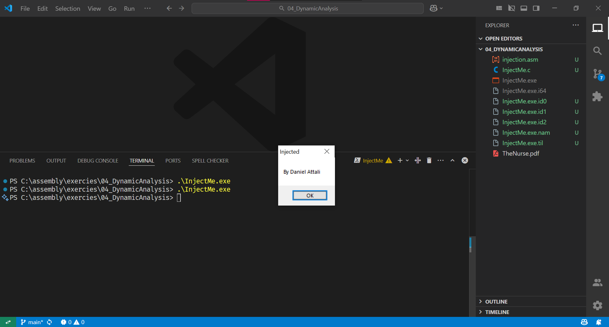
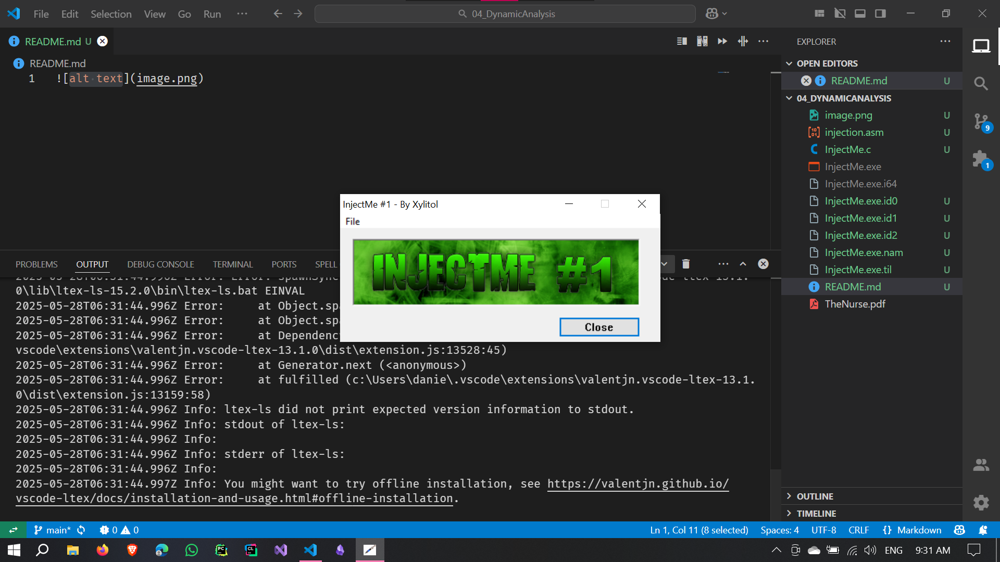
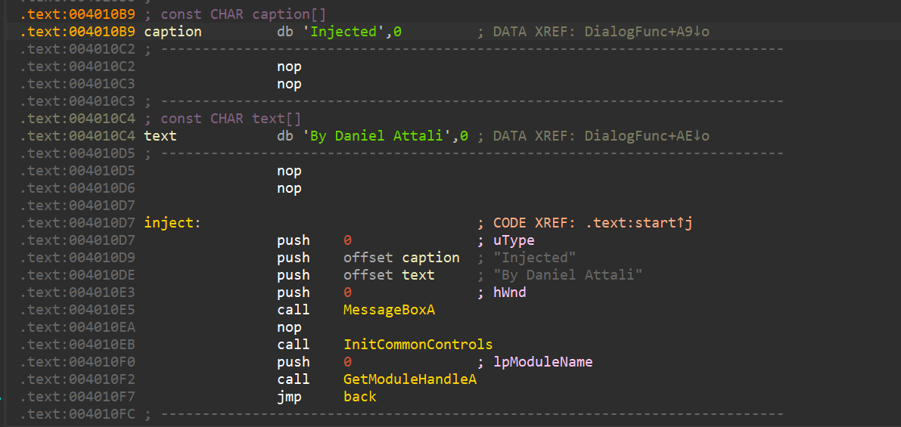
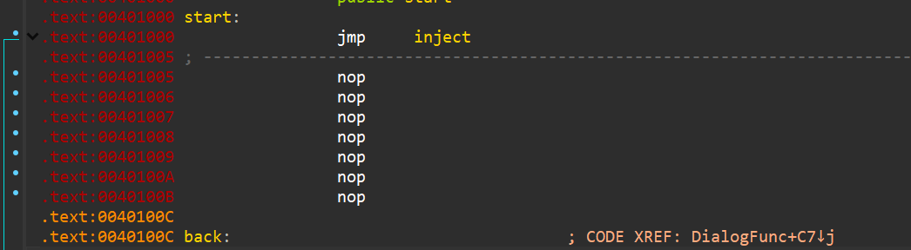

# Intro-to-Reversing

## Assignment 4: `InjectMe.exe`

- Submitted by: Daniel Attali
- Date: 28 May 2025
- Course: Introduction to Reversing

### Final Results





### Writeup

In this assignment, we are tasked with injecting and patching the provided `InjectMe.exe` executable such that the program will popup a message box with my name "Daniel Attali" when executed and then continue to run normally.

The first task is to find where the code could be injected. So when opening the exe in IDA we found a long section of `nop` instructions, which lead us to think this was the right place to inject our code.

So we started by patching the code to add two strings a caption string: `"Injected"` and a text string: `"By Daniel Attali"`.

Then we added the code to call `MessageBoxA` with the context and text strings, and finally we added a `jmp` instruction to jump over the code we injected so that the program continues to run normally.

```assembly
push 0
push offset caption
push offset text
push 0
call MessageBoxA
```



Then we got back to the start of the code at the `start` label and copy the first 3 line of assembly and put it it after the call to the message box with an addition of a `jmp` instruction to jump over the code we injected.

```assembly
jmp back
```

and changed the first 3 lines to:

```assembly
jmp inject
nop
...
```

