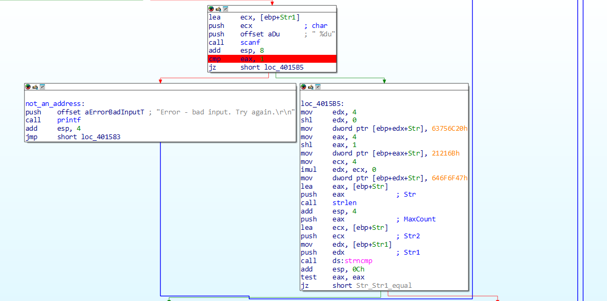
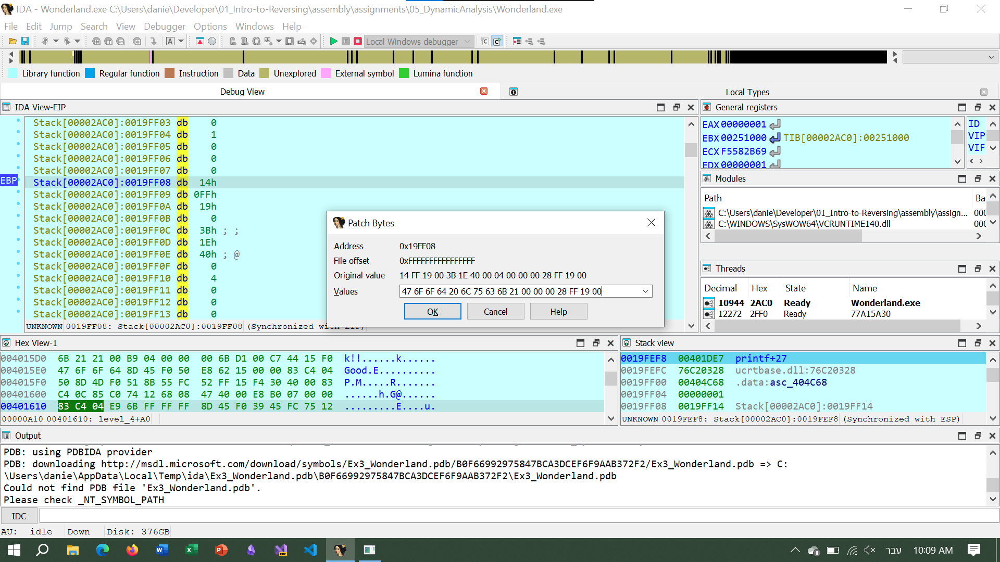
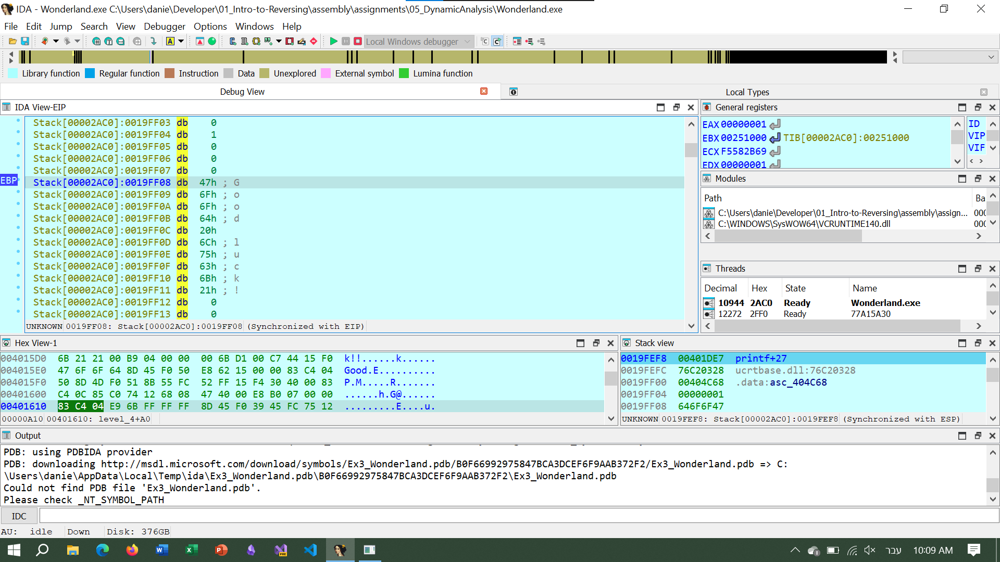
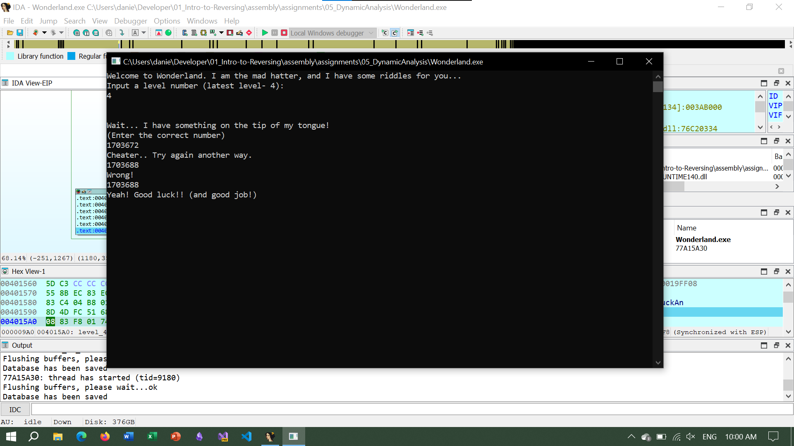
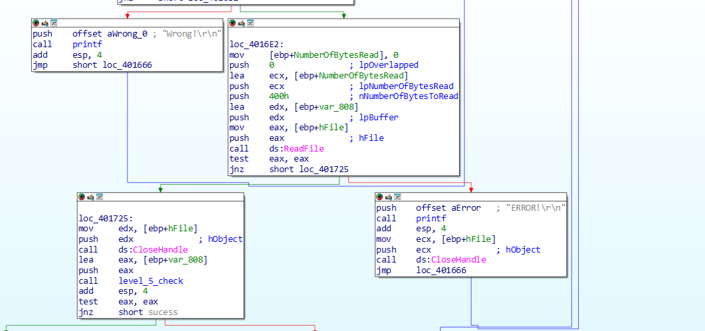
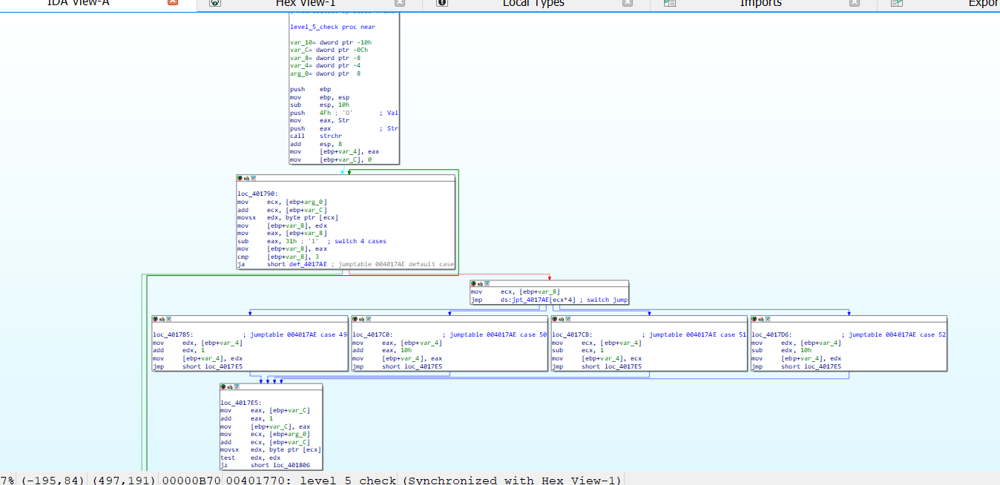
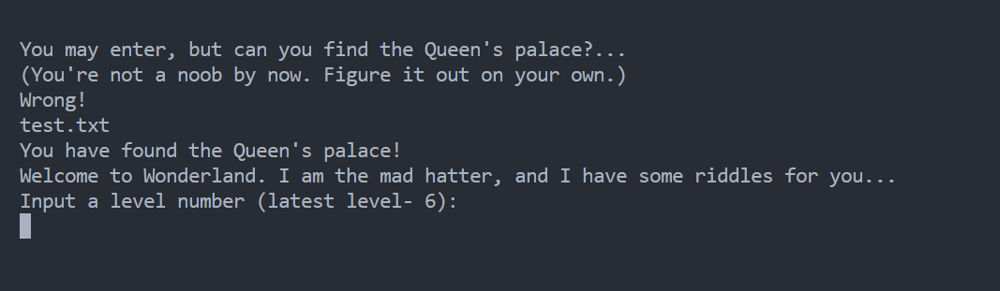

# 05 Dynamic Analysis

## Wonderland.exe 

### Level 4

In this level, we see the following:



A `scanf` call that if input anything of than an `unsigned int `(`%du`) will cause a crash (using stack overflow).

And if input a number if will treat it as an address and try to compare it with the `Str` variable (which is a string that is initialized at runtime to be "Good luck!!")

So the first Idea was to give as an input the address of the `Str` variable (The runtime address so we need to use ida to debug it the address we try was `0x0017FEF8` converted to decimal `1703672`)

And the program output was `"Cheater ..."` so we understood that there was a check to see if `Str == Str1` so we had to give the program an address of a string that was `"Good luck!!"` while at the same time not being the same address of `Str`, the trick was to do it dynamically so we found the a random address and put the the string `"Good luck!!"` and gave the address as input





So we gave as input the address at which we put (at runtime) the string (i.e. `0x0019FF08`) and got the following screen



### Level 5

In this level we see function call like `ReadFile` with options (only if already existed)



So we try and input file name `test.txt` and it didn't work then we try to crate the file first and
then input the name and we got through the first stage and now we needed to understand what the function, so we understood that the program read the file at tha path specified and read into a buffer and then it calls a function (I named it `level_5_check`) and if this function return anything other than `0` we solve the riddle



This function as a switch case form, so we took a look and found we use the `strchr` function with `79` which is `'O'` in ASCII and this function return the first position of a char in a string so we converted the Str string into a more readable form and got: 

```text
"###################O####...########.##...#.########.##.###.########....###...X##################"
```

And then we took at look at the switch statement and saw the following:

1. `case 1:` we move the sort of cursor `+1` so right
2. `case 2:` we do `+16` meaning we jump a line (so the we need to divide the line into chunks of 16)
3. `case 3:` we do `-1` so we move left
4. `case 4:` we do `-16` so we jump a line (up)

So after that we took the sting and made a 16x6 matrix and got the following

```maze.txt
################
###O####...#####
###.##...#.#####
###.##.###.#####
###....###...X##
################
```

So we understood that this is a maze and we start at `'O'` and finish at `'X'` (X mark the spot) and the `'#'` are walls and the `'.'` is the path.

Solution is:

```text
DDDRRRUURRURRDDDRRR
```

```text
2221114411411222111
```

So we put into the `text.txt` file the solution and got the right answer

