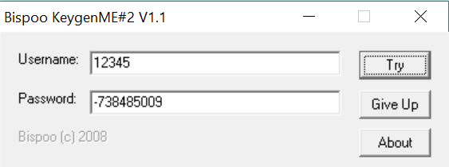
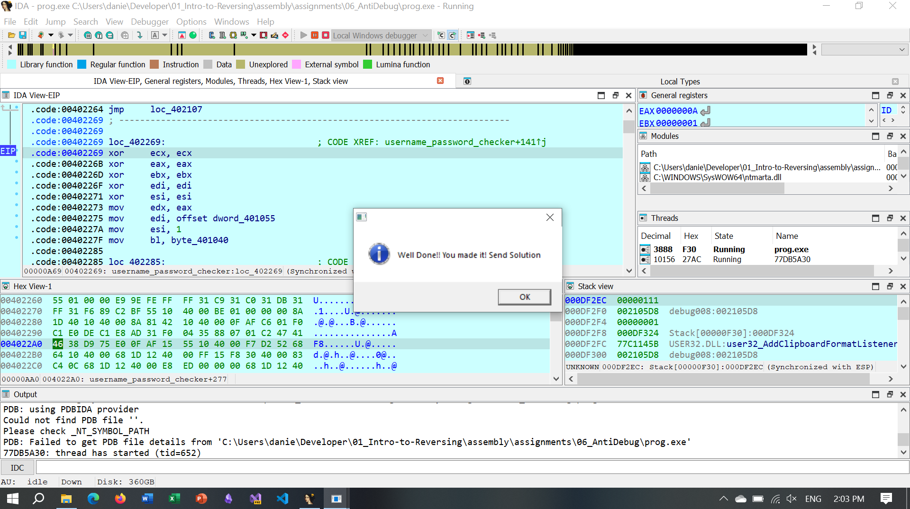

# AntiDebug Assignment 06

- Daniel Attali 328780879

This assignment is to try and find the username and password combo that get us to the success screen.

In this assignment the first we have to understand what are the anti-debug behaviors and find a way to disable them.

We started by finding all the function and giving them appropriate names to understand what is going on:

![[Pasted image 20250615142902.png]]

As we can see we found functions that validate the username and password one that uses some kind of xor encryption decryption scheme but also a function that we have found to check for break points in the code (i.e. `0xCC`) and also a function to check if the program is being debugged with all the anti-debug scheme we learned in class.

The program starts as follows:

![[Pasted image 20250615143049.png]]

but when trying to put a break point and using dynamic analysis the call at `.code0040211` is change from `call ds:DialogBoxParamA` to `call ds:ExitProcess` so we understood that we need to find a way to either disable all the anti debug functions or to jump over them if possible.

![[Pasted image 20250615143251.png]]

The image above is the `is_beeing_debubed` function and has you can see it has a structure of `if` `else if` `else` program and we start by checking if the program is being debugged by calling the `IsDebuggerPresent` function and then we check the special `BYTE` present like we learn in class (i.e. the special byte in each program stub) and if so we call the `break_point_present` function.

![[Pasted image 20250615143531.png]]

This is part of the `is_breakpoint_present` function and has we can see we search the `exe` to check if there is a `0xCC` byte present and if so the program is overwriting some addresses with a value (in runtime we saw the this function patch that program to hide the function of message box etc.).

![[Pasted image 20250615143734.png]]

The image above is the `patch_program` function and we we can see it replaces value at `0x40121D` which are lines of code (assembly) in which we make certain function call.

![[Pasted image 20250615143900.png]]

The function above is the `xor_decrypt_string` function that uses some kind of xor scheme to shred the value at some point in memory.

To remove any anti debug behavior we decided to patch the program our selves.

![[Pasted image 20250615144031.png]]

![[Pasted image 20250615144047.png]]

![[Pasted image 20250615144133.png]]

This change make all the anti-debug function just do nothing.

next part was to use dynamic analysis to see what happens when we input something into the program:

![[Pasted image 20250615144315.png]]

We putted some break point throughout the program and we inputted the following:

- `12345` as username
- `abcde` as password

And we ran the program to the break point and search in memory to see what is happening:

![[Pasted image 20250615144627.png]]

We can see both the username and the password in memory has we inputted and we ran to program further

![[Pasted image 20250615144731.png]]

And we saw that `edi` is pointing to memory at `0x0040106` which is the start of the string `6789:`
we try to put it in as input with no success so we continued investigating

![[Pasted image 20250615144915.png]]

we saw that the program is calling the xor function and we saw that iteration by iteration the string that started at `ecx+edi` is fading away `"-738485009"` so we tried this:

And got the success message

